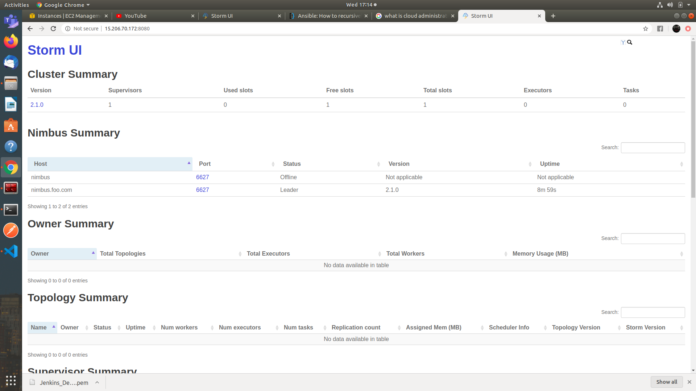

# AWS-Apache-Storm


## How to Run 

- Add you aws pem key to ssh
```sh
  ssh-add <pem kay name>


  change  private_key_file  path in ansible.cfg with your private key path

```

- Activate virtualenvironment first
```sh
source /venv/bin/activate
```
- Add python interpreter path in hosts file
```sh
which python3

add output in python_interpreter in hosts file

Also install boto3 and boto
```

- First add your keys in vault file
```sh
ansible-vault edit key.yml

password: storm

Add AWS keys 

Also add security group name you want

Key is to be present from before
```
- Run playbook using

```sh
ansible-playbook  --vault-password-file=".password" -i ./hosts ec2.yml
```




